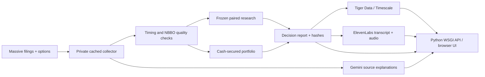

# Filing Edge

**An auditable research desk that can say “do not trade.”** Built for Gator Quant Hacks: Systematic Trading + Massive.

Filing Edge asks whether selling downside insurance after a share-repurchase disclosure earns enough to justify the risk. It follows an idea from source evidence through quoted execution, comparisons, capital limits and an allocation decision. It does not place orders.

## Actual conclusion

Version 2 rejects live allocation. The development comparison had 13 matched pairs and an average difference of **−186.2 bps** of strike collateral. The held-out comparison had only 5 pairs; its positive relative difference does not establish a reliable trading edge. The event trades themselves lost money on average. The constrained held-out portfolio admitted one position and lost **$795.80 on $1 million**. Results include costs. Missing marks use conservative reserves, not fabricated fills.

Version 1's original development findings are retained as an audit record. Version 2 was designed after those findings and frozen before the 2026 test. No profitable parameter was selected after looking at that test.

## Run the complete product

Python 3.11+ is required.

```sh
python3 -m venv .venv
source .venv/bin/activate
pip install -r requirements.txt
cp .env.example .env
# Enter credentials in .env locally. Never commit it.
python cli.py check
python app.py --port 8765
```

Open `http://127.0.0.1:8765`. The hosted static demo, when deployed, is a **saved replay**; the local/authenticated server runs the actual APIs. Raw licensed market responses are not distributed with the source.

## Reproduce the research

Only a Massive key is required. Quotes and historical options access must be included in its entitlements. Optional sponsors do not affect research signals.

```sh
python judge.py --start 2024-01-01 --end 2025-12-31 --mode development
python judge.py --start 2026-01-01 --end 2026-08-31 --mode test
# Judges can choose a different supported historical window:
python judge.py --start 2023-06-01 --end 2023-08-31 --mode sealed
python -m unittest discover -s tests -v
```

`submission/Filing_Edge_Judge.ipynb` is self-contained: it embeds a checksummed source archive and prompts for the Massive key in a clean Python kernel. It does not require a database or any AI key. Supported event windows start March 2022 and end by the configured October 2, 2026 cutoff. Actual availability depends on Massive entitlements.

The first run creates an immutable research freeze and a first-access record for the requested window before downloading returns. Exact reruns load the saved report. Interrupted collection resumes from the private request cache. Never delete an access record to pretend an inspected period is new. The submitted original manifests are in `submission/research-manifest.json`; a new judge workspace records its own reproducibility run.

## What is implemented

- Exact 8-K accession joins and source excerpts; buyback and predefined adverse-tag groups.
- Historical standard-option selection using pre-filing option-only parity estimates.
- Pre-anchor premium/maturity matching among fixed same-issuer comparison dates.
- Timestamped NBBO checks, early-close schedules, spread filters, bid/ask costs and fees.
- Every fixed horizon, expiry/moneyness sensitivity and cost/delay combination; missing counts and exploratory clustered uncertainty.
- Cash-secured account accounting, entry-only liquidity sizing, issuer/total limits and drawdown pause. Missing future quotes never erase an admitted trade.
- Physical-assignment cashflow tests and downside calculator. Historical assignment notices remain unavailable.
- Immutable hashes, date-parameterized judge entry point and a clean-kernel notebook.
- Plain-language onboarding and glossary, evidence explorer, account equity chart and report exports.
- Server-side Gemini, Tiger Data and ElevenLabs integrations; no credentials in the browser.

## Sponsor integrations

| Provider | Substantive role | Verification |
|---|---|---|
| Massive | Filings, contracts, option trades and historical NBBO | Both development and held-out reports use actual API data |
| Tiger Data | PostgreSQL research manifests and option-series hypertable; Timescale continuous aggregate | Data infrastructure reads daily aggregates and saved runs directly from the database |
| Gemini | Evidence-grounded filing explanations | Every quoted span must occur in the supplied filing excerpts; generated interpretations require review |
| ElevenLabs | Accessible audio research briefing | Report-derived deterministic transcript, premade voice, cached MP3 and explicit AI label |
| Databento | Optional catalog check only | Kept out of the trading study to respect its data-source constraints |

## Architecture



`edge/study.py` owns the frozen research pipeline. `edge/portfolio.py` owns funded accounting; `edge/execution.py` validates quotes. `edge/providers.py` keeps keys out of URLs, follows no provider redirects and caches only sanitized responses. `edge/storage.py` implements Timescale writes and queries. `edge/briefing.py` generates audio. `app.py` serves an explicit file allowlist and validates mutation origins.

## Material limitations

This is a hackathon research system, not an institutional trading stack. Historical classification arrival times are not archived; next-session availability is assumed. The fixed 2026 issuer universe can create selection bias. American-option parity uses asynchronous daily prices, a fixed interest rate and no dividends; cross-expiry validation is not implemented. The `maximum_parity_disagreement` setting is reserved, not enforced. The assignment stress helper does not reconstruct actual exercises; `assignment_stress_fraction` is reserved. Displayed quote size is not a fill guarantee. Missing-pair selection and small clusters limit inference. Idle cash earns zero. The account curve's full-strike reserves are deliberately pessimistic and can create artificial mark volatility. No execution venue, live P&L, regulatory workflow or high-availability service is provided.

## Deployment

The Docker image runs a single threaded Gunicorn worker, keeping background job coordination inside one process. Put it behind HTTPS; set `APP_PASSWORD` and sign in as `research`. `render.yaml` provides an optional server deployment. GoDaddy domain ownership is separate from Python application hosting; connect its DNS only after selecting the actual host. No paid plan is purchased by this project.

`docs/` is a zero-secret, static replay suitable for GitHub Pages or a static host. Its banner identifies saved results and disables operations requiring server credentials. It includes sponsor-generated explanations/audio and derived results, not raw API caches. It does not claim to be a live API server.

## Submission bundle

- `submission/Massive_Research_Note.pdf`: 2 pages.
- `submission/Systematic_Trading_Note.pdf`: 5 pages, including results, risk and capacity.
- `submission/Filing_Edge_Judge.ipynb`: clean-kernel replication.
- `submission/research-manifest.json`: hashes and timing audit.
- `submission/DEVPOST.md`: product description and sponsor disclosure.
- `DEMO_SCRIPT.md`: a concise demo sequence.
- `docs/`: portable saved-results demo.

No secret, raw cache, private database URL or user-supplied trading archive belongs in Git or the distributable ZIP.
